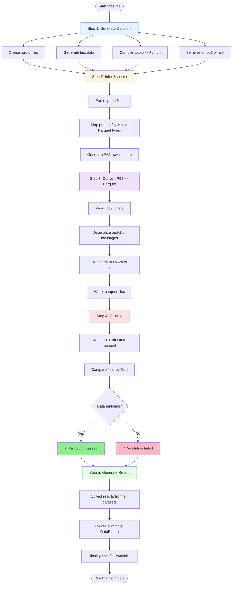

# E2E Data Validation


This project provides end-to-end testing for converting Protocol Buffer 3 (PB3) data to Apache Parquet format.

**📚 [Quick Start Guide](docs/QUICKSTART.md)** - Get started in 5 minutes

## Project Structure

```
.
├── datasets/               # Test datasets with .proto, .json, and .pb3 files
├── src/                   # Source code for the pipeline
│   ├── generator.py       # Generate test datasets
│   ├── schema_inference.py # Infer Parquet schema from .proto
│   ├── converter.py       # Convert pb3 to parquet
│   └── validator.py       # Validate conversion results
├── notebooks/             # Jupyter notebooks
│   └── e2e_conversion_validator.ipynb  # Main pipeline execution notebook
├── docs/                  # Documentation
│   ├── datasets/          # Per-dataset documentation
│   ├── codebase.md        # Codebase guide
│   └── README.md          # Docs index
└── pyproject.toml         # Project configuration
```

## Pipeline Data Flow



**Data Artifacts Generated:**
- **Input**: `.proto` schema definitions
- **Intermediate**: `.json` (test data), `*_pb2.py` (compiled modules), `.pb3` (binary)
- **Output**: `.parquet` (columnar format)
- **Validation**: Field-by-field comparison results

## Test Datasets

The pipeline generates 8 comprehensive datasets covering all major Protobuf3 features:

| Dataset | Features Tested | Files Generated |
|---------|----------------|-----------------|
| **[basic_types](docs/datasets/basic_types.md)** | All scalar primitives (int32, int64, uint32, uint64, float, double, bool, string, bytes) | `.proto`, `.json`, `.pb3`, `.parquet` |
| **[nested_messages](docs/datasets/nested_messages.md)** | Hierarchical message structures, embedded objects | `.proto`, `.json`, `.pb3`, `.parquet` |
| **[repeated_fields](docs/datasets/repeated_fields.md)** | Arrays/lists of primitives and messages | `.proto`, `.json`, `.pb3`, `.parquet` |
| **[maps](docs/datasets/maps.md)** | Key-value pairs with primitive and message values | `.proto`, `.json`, `.pb3`, `.parquet` |
| **[enums](docs/datasets/enums.md)** | Enumeration types with integer values | `.proto`, `.json`, `.pb3`, `.parquet` |
| **[oneof](docs/datasets/oneof.md)** | Union types (mutually exclusive fields) | `.proto`, `.json`, `.pb3`, `.parquet` |
| **[optional_fields](docs/datasets/optional_fields.md)** | Proto3 optional keyword, presence tracking | `.proto`, `.json`, `.pb3`, `.parquet` |
| **[complex_nested](docs/datasets/complex_nested.md)** | Deep nesting with multiple features combined | `.proto`, `.json`, `.pb3`, `.parquet` |

### File Types

Each dataset directory contains:

- **`.proto`** - Protocol Buffer schema definition (human-readable)
- **`.json`** - Test data in JSON format (human-readable)
- **`.pb3`** - Binary Protocol Buffer serialized data (source format)
- **`*_pb2.py`** - Compiled Python protobuf module (auto-generated)
- **`.parquet`** - Converted Parquet columnar data (target format)

Click on any dataset name above to see detailed documentation including schema definitions, Parquet mappings, validation points, and use cases.

## Pipeline Steps

1. **Generate Datasets**: Create test data covering PB3 features
2. **Schema Inference**: Generate Parquet schema from .proto files
3. **Conversion**: Convert .pb3 files to Parquet format
4. **Validation**: Verify data integrity between PB3 and Parquet
5. **Reporting**: Generate success/failure reports

## Results and Analysis

See **[Pipeline Results](docs/results.md)** for:
- Full pipeline execution summary (8/8 datasets pass)

See **[Common Pitfalls and Conversion Bugs](docs/common_pitfalls_and_conversion_bugs.md)** for:
- Bugs found during development, root causes, and fixes
- General landmines for any PB3→Parquet Python pipeline

## Proto3 vs Parquet Compatibility

See **[Proto3 vs Parquet Data Type Compatibility Analysis](docs/data_format_compatibility_analysis.md)** for:
- Master compatibility table reconciling empirical and analytical findings
- Detailed analysis of problematic types (`oneof`, `enum`, `Any`, `Struct`)
- Recommendations on algorithms, libraries, and types to avoid
- Coverage gaps and next steps

## Codebase Guide

See **[Codebase Guide](docs/codebase.md)** for:
- Architecture overview and data flow
- Module-by-module explanation (`generator.py`, `schema_inference.py`, `converter.py`, `validator.py`)
- Key algorithms: varint reading, bracket-counting proto parser, schema-from-proto
- Known limitations and their workarounds

## Usage

```bash
# Run the complete pipeline
jupyter notebook notebooks/e2e_conversion_validator.ipynb
```

The notebook will execute all 5 pipeline steps and generate a comprehensive report showing which datasets passed validation.